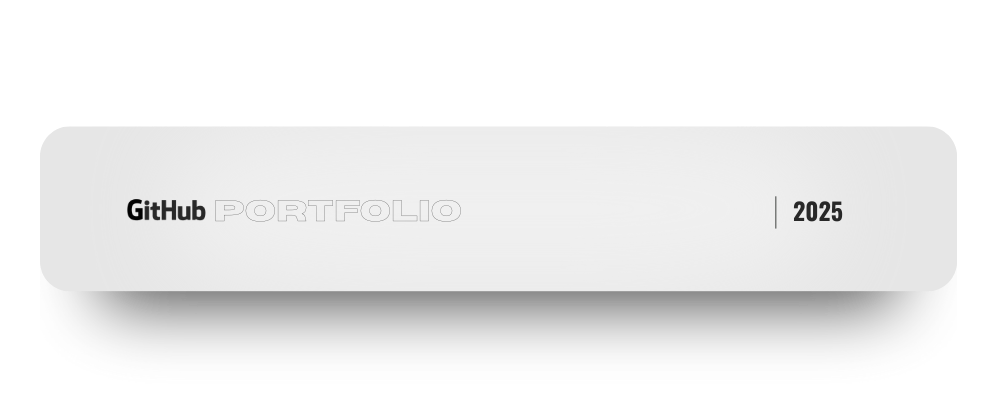

<p align="center">
  
</p>
<div align="center">

```bash
# Viktor Shkrivani
# Entry-level dev who makes GitHub look insane 🚀

$ whoami
> viktorshkrivani

$ skills --list
> Java | Python | JavaScript | PHP | SQL | Webflow | GitHub

$ mission
> Looking for an internship / co-op where I can build, automate, and grow
</div> ```

<!--
**viktorshkrivani/viktorshkrivani** is a ✨ _special_ ✨ repository because its `README.md` (this file) appears on your GitHub profile.

Here are some ideas to get you started:

- 🔭 I’m currently working on ...
- 🌱 I’m currently learning ...
- 👯 I’m looking to collaborate on ...
- 🤔 I’m looking for help with ...
- 💬 Ask me about ...
- 📫 How to reach me: ...
- 😄 Pronouns: ...
- ⚡ Fun fact: ...
-->
